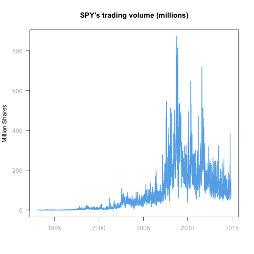

Stock Chart
========================================================
author: Marco Mascherpa
date: November 19th, 2014
font-family: 'Helvetica'
transition: rotate

Introduction
========================================================

Stock Chart is an application that displays charts over an interval of time for several stock metrics such as

- Returns adjusted for dividends and stock splits
- Trading volume in millions of stocks per day
- Daily trading range in percentage of stock price

Data Source
========================================================

- Data comes from Yahoo using *read.csv*
- The example below shows data for ticker *SPY*


```
'data.frame':	5496 obs. of  7 variables:
 $ Date     : Date, format: "2014-11-21" "2014-11-20" ...
 $ Open     : num  208 204 205 204 204 ...
 $ High     : num  208 206 206 206 205 ...
 $ Low      : num  206 204 204 204 204 ...
 $ Close    : num  207 206 205 206 204 ...
 $ Volume   : int  142281500 72506900 82271200 75981700 80380500 80374200 85209900 90010300 54297600 66133300 ...
 $ Adj.Close: num  207 206 205 206 204 ...
```

Plots
========================================================

Based on data in the date range selected three charts are generated to display Returns, Volume and Range

 

Technicalities about Stock Chart
========================================================
- Downloads new data only when
  - a new ticker is entered **and**
  - the update button is pressed
- Uses the *isolate()*  function to avoid reactive behavior on the ticker input
- Displays plots using tabs (via the *tabPanel()* function )


